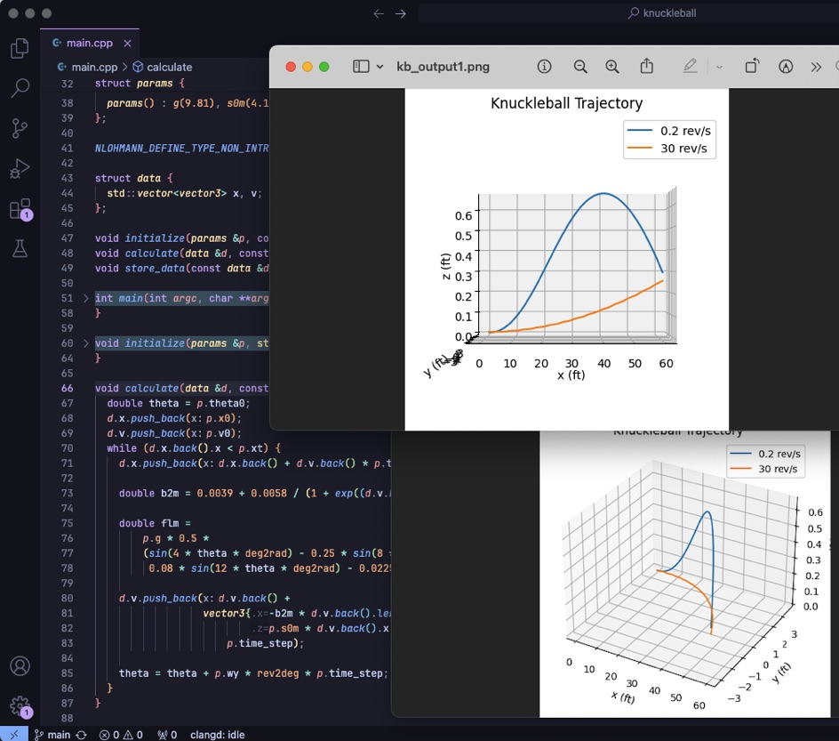

# Knuckleball Simulation

Sounds like fiction, but it is physically possible to launch a ball in a way it “zig-zag”s from side to side in the air, changing directions. That’s a knuckleball; very appreciated effect in sports.

The effect is related to the stitches in the ball, it generates an imbalance of forces at the different edges of the ball causing the deflection; a slow spin is also required, for the stitches to change position, and so the deflection direction; a too fast spin changes the stitches position too fast causing an oscillation instead of a noticeable change in direction.

I’ve implemented some numerical calculations to simulate a (baseball’s) knuckleball trajectory; in the results, z-direction is the side curve the ball is taking in the air; note how it goes, and then comes back; also note the second case where it oscillates.
